# UNDER THE C

- Member  : 김승윤, 백지엽, 오신옥, 홍인표
- Status : Complete
- Tag : Project

## 1. 프로젝트 소개

탄소배출에 대한 빅데이터 분석을 기반으로 미래의 탄소배출량 및 탄소배출권 가격 등을 예측하여 기업의 ESG 경영을 지원하기 위한 서비스 입니다. 

## 2. 프로젝트 배경

### 탄소중립이란?

- 배출하는 탄소량과 흡수(산림), 제거(CCUS)하는 탄소량을 같게함으로써 총 탄소배출량을 'zero(0)' 로 만드는 것

  

### 탄소배출권이란?

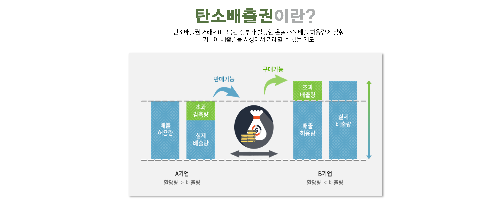

### 왜 탄소중립인가?

- 이산화탄소를 비롯한 온실가스에 의한 지구온난화로 최근 30년간 평균온도 1.4°C 상승
- 기후변화로 인한 폭염, 폭설, 태풍, 대규모 산불 등 자연재해 발생빈도 증가

### 우리나라의 탄소중립 정책, 이대로 괜찮은가?

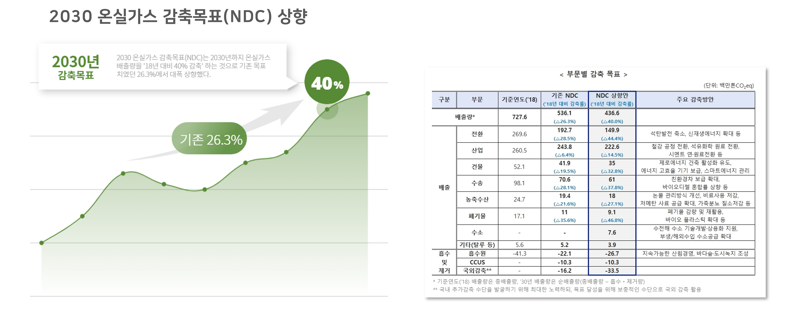

- 최근 한국정부는 2030 온실가스 감축목표(NDC)를 기존 목표치였던 26.3%에서  40% 감축하는 것으로 목표를 대폭 상향했습니다. 

- 그러나 오랜기간 배출량을 줄여온 기후 선진국들에 비해 2018년에 배출정점을 기록한 한국의 입장에서 이번 감축목표는 매우 도전적인 과제입니다.

  **<탄소중립 대응관련 설문결과>**

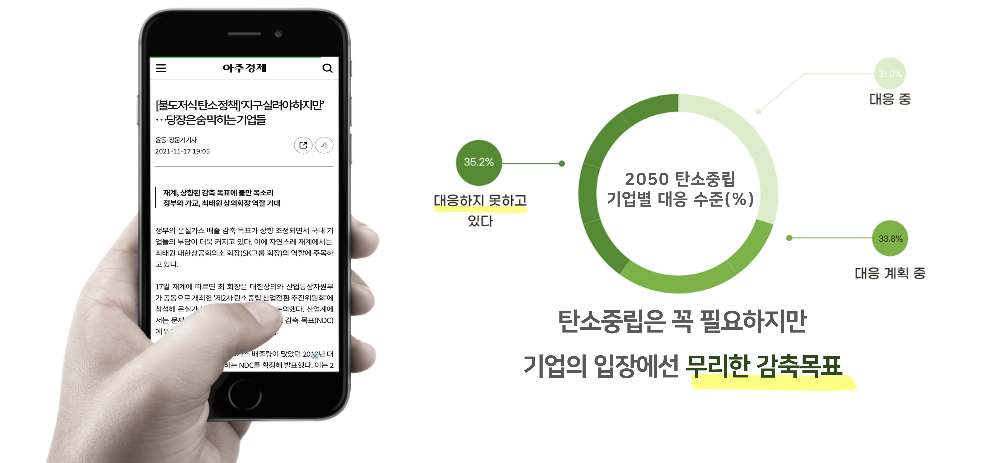

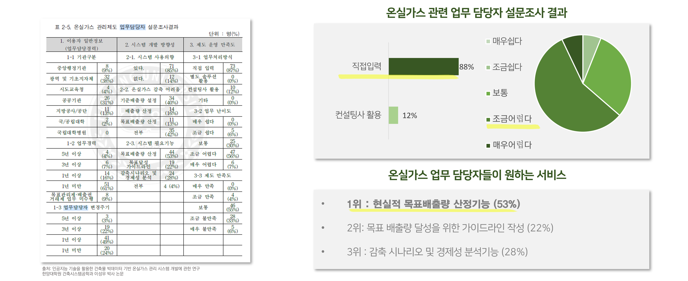

- 설문조사에 따르면 탄소중립에 대응 중인 기업은 31%로 매우 적게 나타났습니다.
- 또 각 기업의 온실가스 관련 업무 담당자들이 원하는 서비스로  '현실적 목표 배출량 산정기능'이 가장 많은 응답률(53%)을 기록하며 업무 어려움의 원인을 파악할 수 있었습니다. 

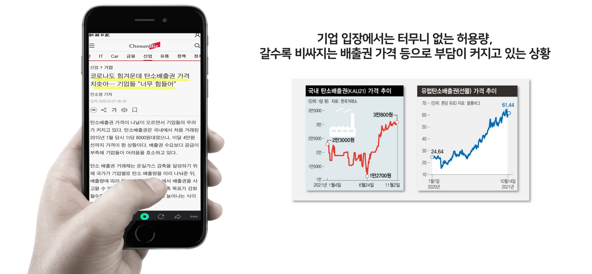

- 터무니없이 적은 탄소배출 할당량과 갈수록 비싸지는 탄소배출권의 가격은 기업에 많은 부담으로 작용하고 있습니다. 

## 3. 프로젝트 목표

본 프로젝트는 탄소중립실현을 위해 부문별 탄소배출량 및 배출권 가격을 예측하고, 탄소배출 증감요인을 분석해 시각화한 현황대시보드를 제공합니다.

탄소중립과 관련한 정부의 정책 및 기업의 대응 전략 수립에 활용될 수 있는 기초 자료를 제공하는데 목적이 있습니다.

## 4. 시스템 구성도

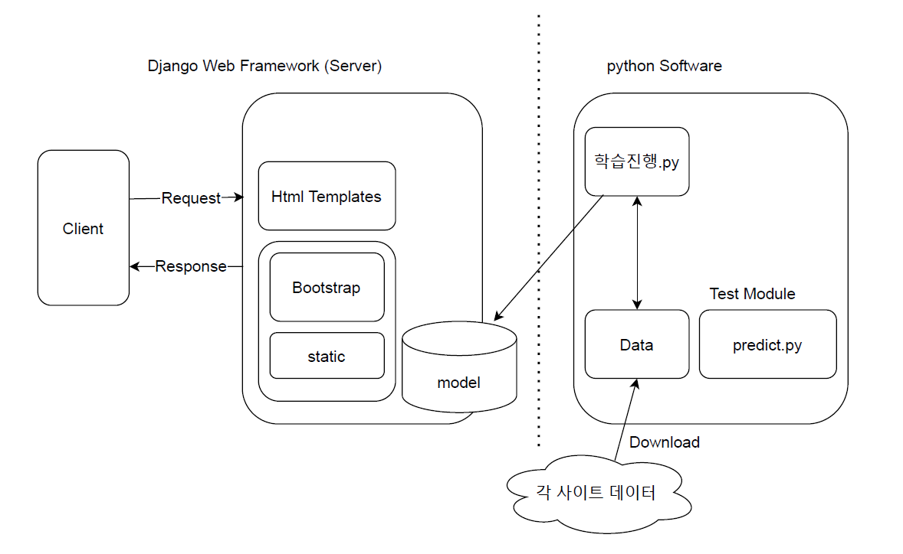

### 

## 5. 서비스 소개

### 탄소배출현황 시각화 대시보드

- Tableau BI solution 활용
- https://public.tableau.com/app/profile/.15743601/viz/CARBONEMISSIONSDASHBOARD/sheet34

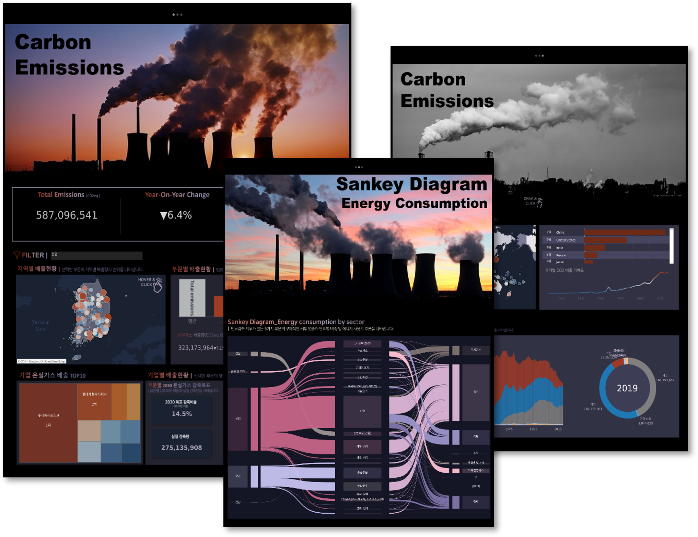

**1.부문/기업별 온실가스 배출현황**

- 국내의 전반적인 온실가스 배출현황과 탄소감축의무를 가지는 6가지 부문(전환, 산업, 수송, 폐기물, 건물, 공공및기타)에 해당하는 기업들이 2030 온실가스 감축목표를 달성할 수 있도록 구체적이고 실질적인 감축량을 제시합니다. 

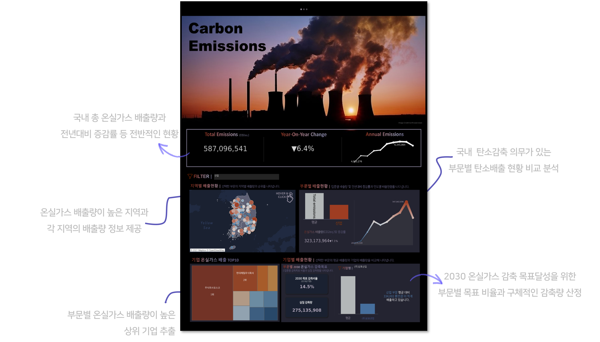

**2.부문별 에너지 사용량**

- 탄소감축의무가 있는 5가지 부문의 전반적인 에너지 사용 현황과 각 부문별 세부업종 및 연료별 사용량을 제공함으로써 산업군 특성을 고려한 효과적인 에너지 소비전략 수립에 도움을 줍니다.

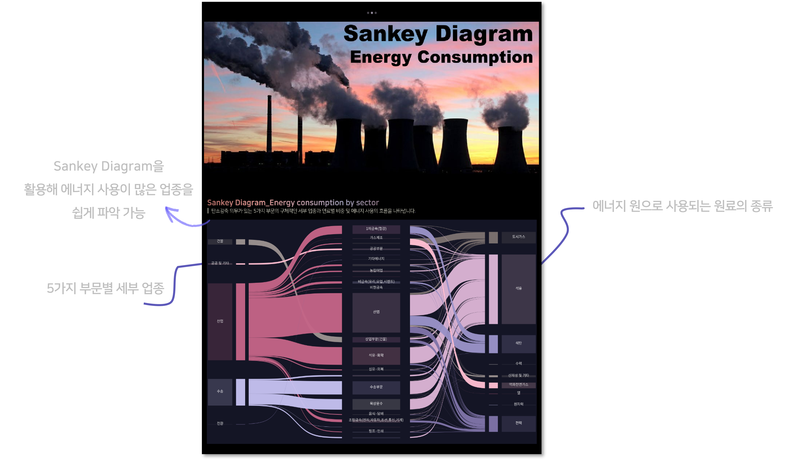

**3.국가별 온실가스 배출량**

- 국가별 타소배출현황과 순위 및 탄소배출 기여도를 파악하고, 탄소배출의 원인이 되는 연료의 사용 비율 정보를 제공합니다. 

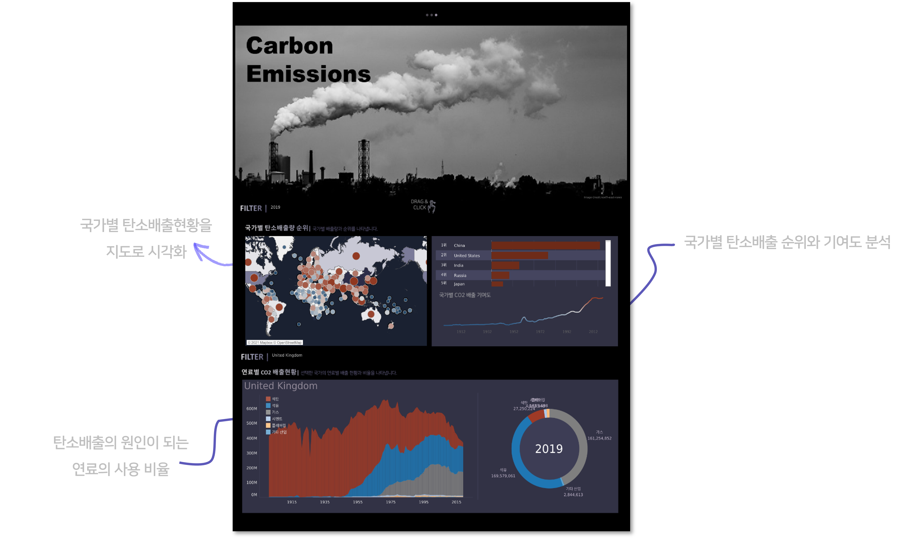

### 탄소배출권 가격 및 탄소배출량 예측

- 다변인 선형회귀 

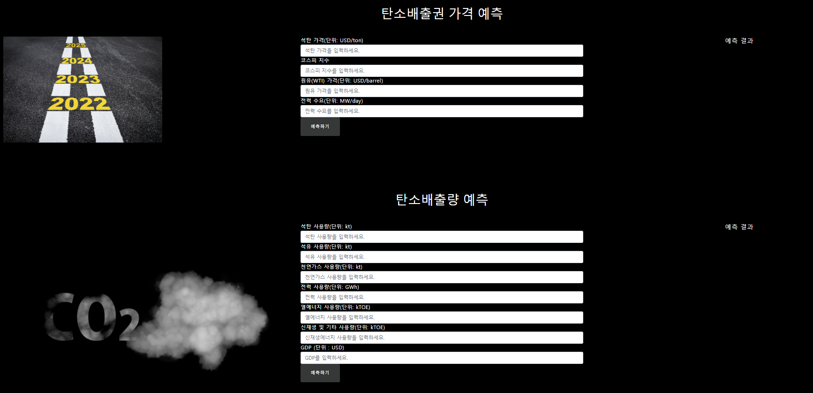
